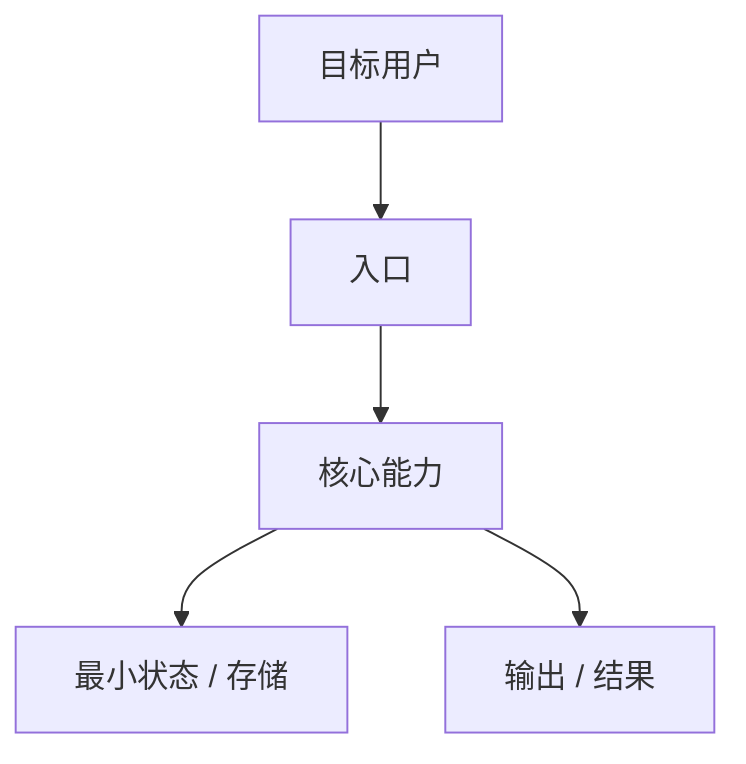

# Day 0 产品与技术方案复原

## 这一节解决什么问题

[说明本节不是写未来新功能方案，也不是复述当前源码；它要从现有源码、README、文档和 commit 证据中，反向复原作者在 Day 0 会如何理解需求、定义产品边界、选择初始技术方案。]

## 需求起点

**目标用户**：[谁会遇到这个问题]

**核心任务**：[用户最想完成的 1-3 个任务]

**现有替代方案的问题**：[不用这个项目时，用户会怎么做，痛点是什么]

**产品成功标准**：[第一版做到什么程度就算有用]

**明确不做什么**：[Day 0 应该排除的范围，避免过度设计]

## MVP 边界

| 能力 | Day 0 是否必须 | 为什么 | 证据来源 | 证据等级 |
|------|----------------|--------|----------|----------|
| [能力] | [必须/可以没有] | [需求原因] | [README/docs/code/commit] | [明确证据/强推断/弱推断] |

## Day 0 技术方案

**最小架构**：[用最少模块满足 MVP 的架构]

**核心数据模型**：[最早必须存在的数据结构、配置、状态或协议]

**核心流程**：[用户从入口到完成任务的最短链路]

**技术选择**：[语言、框架、存储、CLI/API/UI 等选择，以及为什么够用]

## 从 MVP 到当前系统

| 产品压力 | 暴露的问题 | 技术变化 | 当前代码落点 |
|----------|------------|----------|--------------|
| [压力] | [问题] | [新增模块/接口/状态] | [文件/函数/类型] |

## 作者视角的设计取舍

| 设计选择 | 替代方案 | 为什么 Day 0 可能这样选 | 代价 |
|----------|----------|--------------------------|------|
| [选择] | [替代方案] | [需求/成本/复杂度原因] | [代价] |

## 证据等级

| 判断 | 证据等级 | 证据来源 | 需要确认的问题 |
|------|----------|----------|----------------|
| [判断] | [明确证据/强推断/弱推断] | [README/docs/code/commit] | [问题] |

## 如果我是作者，今天从 0 开始

[基于上面的复原，说明今天重新做第一版时，会保留哪些 Day 0 决策、删掉哪些复杂度、延后哪些能力。]
