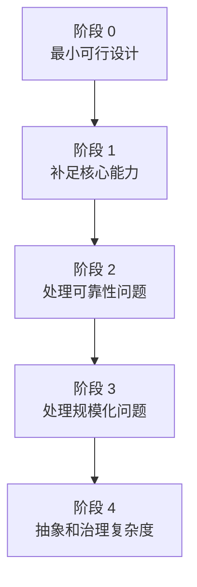
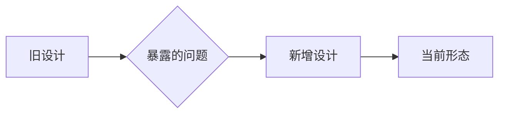
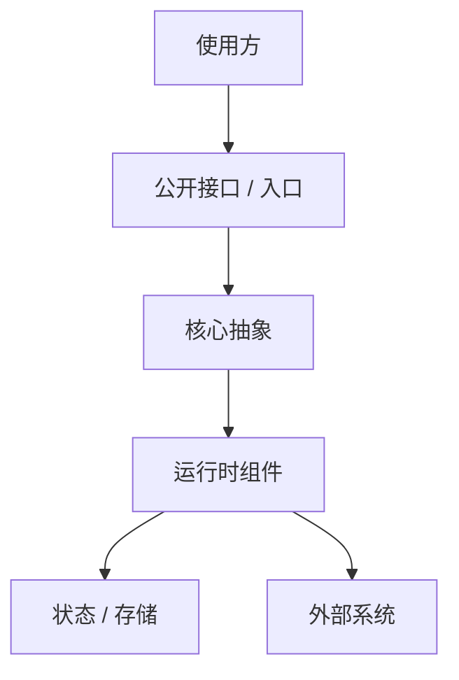

# 从 0 设计：[系统 / 机制名称]：一步一步演进

## 这一节解决什么问题

[说明本节不是复述源码，也不是复述提交历史，而是从第一性原理出发：如果今天重新设计这套系统，最小方案是什么，为什么会一步步补出当前系统中的模块、状态、接口和约束。]

## 第一性原理

**系统要解决的根本问题**：[一句话说明最核心的问题]

**最小可行设计**：[如果只解决最核心问题，最简单的设计是什么]

**不可违背的约束**：[可靠性、性能、并发、一致性、可观测、兼容性、成本等硬约束]

**主要权衡轴**：[例如简单性 vs 可靠性、吞吐 vs 一致性、灵活性 vs 学习成本]

## 总体演进地图

| 阶段 | 新增能力 | 新增抽象 / 模块 / 状态 | 解决的问题 | 付出的复杂度 |
|------|----------|------------------------|------------|--------------|
| 0 | [能力] | [抽象] | [问题] | [复杂度] |

---

## 分阶段推演

每个阶段按以下结构说明：

### 阶段 [N]：[阶段名称]

**最小方案**：[这一阶段开始时最简单可行的设计]

**为什么不够**：[这个设计在什么场景下失败，或者会造成什么维护/扩展问题]

**新增设计**：[为了补足问题，需要新增什么模块、状态、接口、后台任务或约束]

**复杂度代价**：[新增设计带来了哪些认知、实现、运行时或兼容成本]

**当前代码对应点**：[当前项目中哪些文件、类型、函数体现了这个设计]

---

## 最终系统形态

[解释最终形态中最重要的模块和边界。重点说明它们为什么必须分开，而不是把所有逻辑放在一个地方。]

## 设计取舍总结

| 设计选择 | 替代方案 | 为什么选择当前方案 | 代价 |
|----------|----------|--------------------|------|
| [选择] | [替代方案] | [原因] | [代价] |

## 如果重新实现

[基于第一性原理和当前代码经验，说明如果今天重新实现，哪些设计仍然会保留，哪些可以简化，哪些需要重新验证。]
