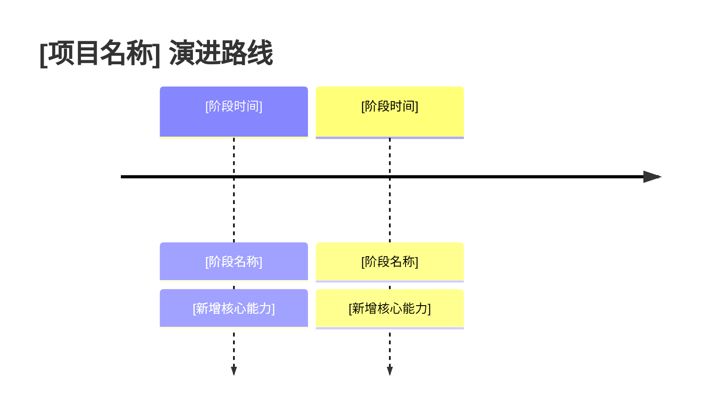
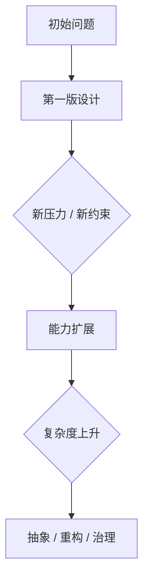

# 系统演进历史

## 这一节解决什么问题

[说明为什么需要从 Git 提交历史理解这个项目。重点不是罗列提交，而是解释系统能力、模块边界和设计取舍是怎样被真实需求一步步推出来的。]

## 演进路线总览

| 阶段 | 时间 / commit 范围 | 核心变化 | 解决的问题 | 演进原因 |
|------|-------------------|----------|------------|----------|
| [阶段 1] | `[commit]` - `[commit]` | [新增/重构了什么] | [当时的问题] | [为什么需要这样演进] |

---

## 阶段拆解

每个阶段按以下结构说明：

### [阶段名称]

**历史证据**：[列出关键提交、合并请求、版本标记或文件变更；必须来自 Git 提交历史]

**当时的系统形态**：[这个阶段系统大致长什么样，核心模块如何协作]

**暴露的问题**：[旧设计为什么不够用，遇到了什么需求压力或维护压力]

**引入的变化**：[新增能力、模块、接口、数据结构、配置或边界]

**为什么这样演进**：[解释这条路线的原因；区分 commit 事实和基于 diff 的推断]

**留下的影响**：[这个阶段的设计在今天的代码中还留下了什么结构或约束]

---

## 关键转折点

[列出 3-5 个最重要的转折点。每个转折点说明：旧路线是什么、新路线是什么、为什么必须转向。]

| 转折点 | 之前的设计 | 之后的设计 | 转向原因 | 当前影响 |
|--------|------------|------------|----------|----------|
| [转折点] | [旧设计] | [新设计] | [原因] | [影响] |

## 演进思路总结

[用一段话总结：这个系统的演进主线是什么？它更偏向功能扩展、可靠性补强、性能优化、生态适配，还是维护性治理？]

## 事实与推断边界

- **明确事实**：[提交、差异或发布说明直接能证明的结论]
- **合理推断**：[基于变更顺序、代码结构和上下文推断出的设计动机]
- **仍不确定**：[需要作者背景、issue、PR 讨论或外部资料才能确认的问题]
