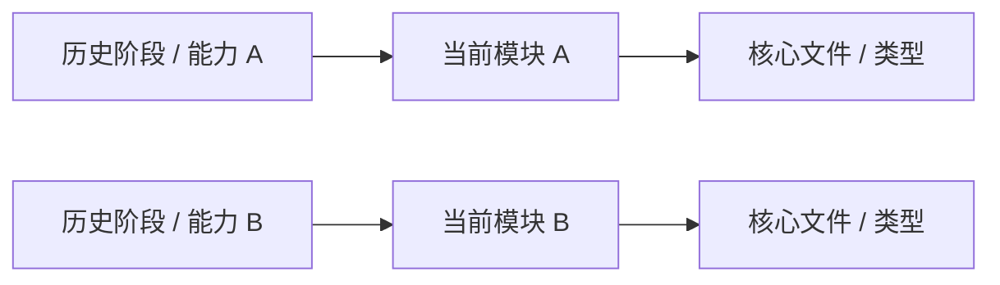
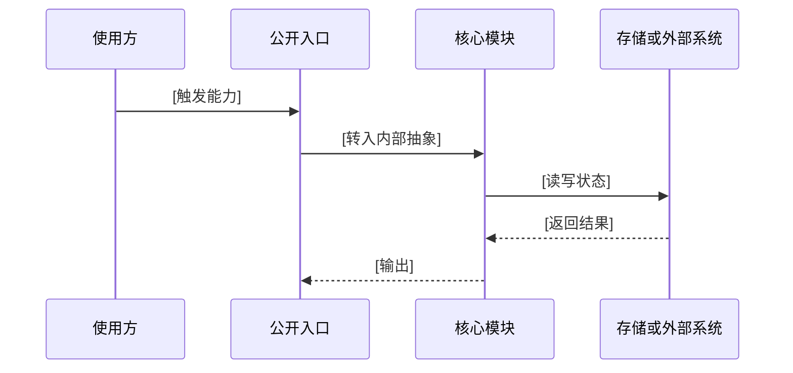

# 实现地图

## 这一节解决什么问题

[说明本节如何把历史演进中的能力映射到当前代码。目标是回答：曾经引入的设计，今天分别落在哪些模块、接口、数据结构和运行流程里。]

## 能力到实现的总览

| 历史能力 | 当前实现位置 | 核心抽象 | 运行时入口 | 为什么落在这里 |
|----------|--------------|----------|------------|----------------|
| [能力] | `[目录/文件]` | `[类型/接口]` | `[函数/命令/API]` | [原因] |

---

## 当前实现分层

按当前代码结构说明每一层：

### [层 / 模块名称]

**它承接了哪段历史演进**：[对应 `07_evolution_history.md` 中的阶段或能力]

**它现在负责什么**：[当前职责边界]

**关键代码位置**：[核心文件、类型、接口、函数]

**为什么边界这样划分**：[为什么不是放在其他层，解决了什么维护或扩展问题]

---

## 核心能力落点

[选择 5-8 个最重要能力，说明它们从用户入口到内部实现的路径。]

| 能力 | 用户入口 | 内部路径 | 状态 / 数据 | 关键失败点 |
|------|----------|----------|-------------|------------|
| [能力] | [入口] | [调用链] | [状态] | [失败点] |

## 历史包袱与当前约束

[说明哪些当前代码复杂度来自历史兼容、生态约束、性能要求或曾经的设计选择。不要只说“复杂”，要指出复杂度的来源。]

| 当前复杂点 | 来源阶段 | 为什么还保留 | 如果重做可以怎样简化 |
|------------|----------|--------------|------------------------|
| [复杂点] | [阶段] | [原因] | [可能方案] |

## 继续改代码的入口

[为后来贡献者总结：如果要改某类能力，应该先读哪些文件、注意哪些历史约束。]

| 修改目标 | 先读哪里 | 需要理解的历史原因 | 风险 |
|----------|----------|--------------------|------|
| [目标] | `[文件]` | [历史原因] | [风险] |
